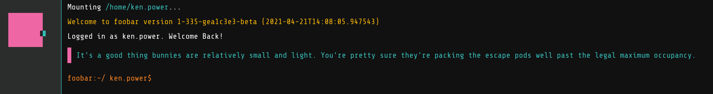
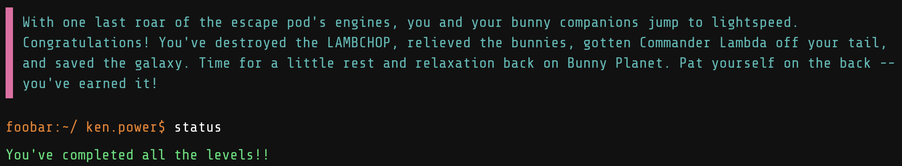

# The Google Foobar Challenge

The Foobar Challenge is Google's semi-secret coding challenge that they use as a recruitment tool. Access is by invitation only. I suggest taking up the invitation if you get the opportunity. Apart from anything else, it provides an interesting and enjoyable set of coding challenges. 



Once you accept the challenge, you get a message like this:

``
"Success! You've managed to infiltrate Commander Lambda's evil organization, and finally earned yourself an entry-level position as a Minion on their space station. From here, you just might be able to subvert Commander Lambda's plans to use the LAMBCHOP doomsday device to destroy Bunny Planet. Problem is, Minions are the lowest of the low in the Lambda hierarchy. Better buck up and get working, or you'll never make it to the top..."
``

Foobar provides a basic virtual workspace to work in via a Web browser. You can also work offline and paste your solution into the editor in Foobar. Foobar provides two test cases per solution. In addition, there are a number of hidden test cases that your code must pass before you can submit your solution. You can verify your solution before submitting, and it will tell you how many tests are passing and how many are failing, but it won't tell you what those failing tests are. There is a time limit for each challenge. It's pretty reasonable, allowing you to take a break and come back when you have time. 

## Levels

The Foobar challenge has five levels with roughly increasing difficulty. I say _roughly_ because I found the difficulty peaked at Level 4. Each level has one or more challenges that must be completed in sequence. I believe there are always five levels, though the specific challenges you get at each level might be different to the ones I got. I was presented with 9 challenges over the 5 levels. 

Each challenge has a name, shown below, and a backstory that relates to the problem domain. Part of the challenge is to understand what, exactly, the problem is. While the problem might be phrased in terms of intercepting secret notes, rescuing bunnies, distracting bunny trainers, or dodging lasers, solving the challenge involves recognizing that the problem and solution are based on concepts such as ciphers, graph algorithms, shortest path algorithms, or mathematical sequences. 

Click on the links below to see my solutions to the challenges. Foobar provides the option to implement your solution in either Python or Java. I opted for Python. Whichever language you opt for there are [constraints that your solution must adhere to](#python-constraints). 

For each challenge, I provide my solution code and some background notes on my implementation choices. I also provide the source code for the tests I developed. I implemented these tests as unit tests using the `unittest` framework. 

### Level 1

1. [Lance and Janice](./Level_1/1_LanceAndJanice). Decode encrypted messages. This challenge illustrates the use of the Atbash Cipher, a straightforward substitution cipher that is sometimes called mirror code. It is believed to be the first cipher ever used. 

### Level 2

2. [Don't Get Volunteered](./Level_2/2_DontGetVolunteered). Figure out the fewest possible steps to get from a source to a destination in a constrained space. The challenge here is to find the minimum number of moves on a chess board taken by a knight to get from a given source square to a specific destination square. 
3. [Ion Flux Relabeling](./Level_2/3_IonFluxRelabeling). Find the parent nodes for each of a given set of nodes in a perfect binary tree.

### Level 3

4. [Queue To Do](./Level_3/4_QueueToDo). Generate the correct checksum for a sequence of numbers given just the starting number and the length of the sequence. The length of the sequence can vary, and not all numbers in the sequence are used for the checksum, so part of the challenge is figuring out the pattern.
5. [The Grandest Staircase of Them All](./Level_3/5_TheGrandestStaircase). Work out how many staircases can be built from a given number of bricks. This is a partitioning and combinatorics problem; in this case not all possible partitions are valid under the given constraints of what constitutes a staircase. My solution uses the memoization optimization technique, dynamic programming and recursion to check different staircase combinations and find the optimal number of staircases that can be built.
6. [Fuel Injection Perfection](./Level_3/6_FuelInjectionPerfection). Given an initial number and constrained by a fixed set of operations (`add 1`, `subtract 1`, `divide by 2`), figure out the minimum number of operations required to reduce the number to 1. 

### Level 4

7. [Distract the Trainers](./Level_4/7_DistractTheTrainers). Construct maximum matchings on a graph. I implemented the Blossom algorithm to solve this one. This challenge involved solving some additional sub-problems including implementing Euclid's algorithm to find the greatest common divisor of two numbers, using bitwise operators to determine if a number is a power of two, and finding a convenient way to compare graph elements. I used an adjacency list to represent the graph for this challenge.  
8. [Running with Bunnies](./Level_4/8_RunningWithBunnies). Given a graph and a time limit, find the shortest path between all ordered pairs of nodes. This is an example of the all-pairs shortest-paths problem. I implemented the Floyd–Warshall Algorithm for this one. The Floyd-Warshall algorithm is used to find shortest paths in a directed weighted graph with positive or negative edge weights (but with no negative cycles). I used a matrix to represent the graph for this challenge.

### Level 5

9. [Dodge the Lasers](./Level_5/9_DodgeTheLasers). Given the string representation of an integer `n`, return the sum of `(floor(1*sqrt(2)) + floor(2*sqrt(2)) + ... + floor(n*sqrt(2)))` as a string. This is an example of the Beatty Sequence. In mathematics, a Beatty sequence (or homogeneous Beatty sequence) is the sequence of integers found by taking the floor of the positive multiples of a positive irrational number. The square root of 2 is the best-known positive irrational number. 

## Completing the Levels

After completing all five levels, I got the following message, confirming the bunnies are safe and the galaxy has been saved.



I also got to see the bunnies dancing in celebration :-)


Foobar also provides an encrypted message to decode, using your username as the decryption key. I wrote the following Python script to decode the message:

```python
import base64

MESSAGE = '''
YOUR SECRET MESSAGE
'''

KEY = 'YOUR KEY'

result = []
for i, c in enumerate(base64.b64decode(MESSAGE)):
    result.append(chr(ord(c) ^ ord(KEY[i % len(KEY)])))

print ''.join(result)
```

Decrypting the message reveals the following JSON-style output:
```
{
  'success' : 'great', 
  'colleague' : 'esteemed', 
  'efforts' : 'incredible', 
  'achievement' : 'unlocked', 
  'rabbits' : 'safe', 
  'foo' : 'win!'
}
```

You also get two invitation codes that you can share with friends.

## Python Constraints

These are the constraints I had to work with (April 2021):

* Your code will run inside a Python 2.7.13 sandbox. All tests will be run by calling the `solution()` function.
* Standard libraries are supported except for `bz2`, `crypt`, `fcntl`, `mmap`, `pwd`, `pyexpat`, `select`, `signal`, `termios`, `thread`, `time`, `unicodedata`, `zipimport`, `zlib`.
* Input/output operations are not allowed.
* Your solution must be under 32000 characters in length including new lines and other non-printing characters.

